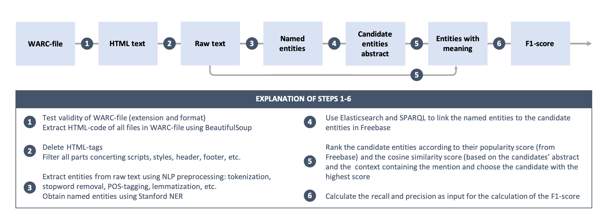

# Setup and running
Summary of all the commands that need to be issued in order to run the solution.
## Python
This project is configured to run with **Python 3.6**. In order to load Python 3.6 on the DAS4 cluster, please run: 

`module load python/3.6.0`

## Hadoop

Please make sure you have Hadoop module enabled: 

`module load hadoop/2.7.6`.

## Prun

Please make sure you have Prun module enabled. This is necessary in order to reserve nodes for Elasticsearch
and Trident:

`module load prun`

## Input file

The input script requires the WARC archive to be stored in **HDFS**. You can store a WARC archive by using the following
command as an example:

`hadoop fs -put /home/wdps1902/data/sample.warc.gz /user/wdps1902` 

## Project location

This project can be found in the DAS4 cluster under: ***/home/wdps1902/html-processor***. You can navigate there by issuing the commmand:

`cd /home/wdps1902/html-processor`.

## Installing Dependencies 

Make sure you are in the */home/wdps1902/html-processor* directory, after which you can install the project dependencies
using the following commands:

```
 python3 -m venv venv
 source venv/bin/activate
 venv/bin/python -m pip install -r requirements.txt
```

## Running

Use the following command to run the application. This will setup an Elasticsearch instance and a Trident instance on 2 
nodes and it will submit an Apache Spark Task to execute the solution: 

`./run_spark.sh <INPUT_WARC_FILE_FROM_HDFS> <OUTPUT_TSV>`

* **INPUT_WARC_FILE**: A warc file archive stored in **HDFS**, e.g. *hdfs:///user/wdps1902/sample.warc.gz*
* **OUTPUT_TSV**: The name of the file where the output will be stored, example: `output.tsv`. 

## F1 Score

After the script is finished executing, you can calculate the **F1** score using the provided Python script: 
`python3 src/score.py <BENCHMARK_FILE> <OUTPUT_FILE>`
* **BENCHMARK_FILE**: represents a tab separated file with the benchmark values;
* **OUTPUT_FILE**: represents a tab separated file with the output predictions returned by the script.

# Summary of the process 
We divide the process roughly in three stages: 
1. Extraction of Raw Text from WARC-file
2. Entity Extraction
3. Entity Linking

All processes consist of multiple steps. An overview of the process is given in the diagram below. 


## (1 & 2) Extraction of Raw Text from WARC-file
To start the entity linking process, we first need to extract the raw text from the HTML-pages in the WARC-file. 
* Read the WARC-file and check the validity in terms of extension and format.
* Use the library “BeautifulSoup” to strip the text from all HTML tags and to remove scripts, styles, footers, headers, etc. 

## (3) Entity Extraction
After the raw text is obtained, the knowledge extraction process is started. The entity extraction is divided into two parts:

### NLP preprocessing
We use the "NLTK"-library to perform the Natural Language Processing (NLP) tasks.
* Tokenize the text.
* Give each token a POS-tag and filter on the nouns.
* Remove English stopwords.
* Lemmatize the tokens to transform among other things the plural form of a word to the singular form.

### Named Entity Recognition
After the preprocessing, we go find the named entities. This process is called Named Entity Recognition. The classifier we use is StanfordNER.

## (4 & 5 & 6) Entity Linking
After the entity mentions in the document are extracted, we link the mentions with their named entities to the Knowledge Base. We divide the entity linking into the following parts:

### Candidate Entity Generation - Query the Knowledge Base
If the mention is an English word, we link the input surface form of the mentions using ElasticSearch to Freebase. We'll obtain the 20 candidate named entities with the highest popularity score.

### Candidate Entity Ranking - Rank the candidate named entities
Next, we assign a score to each of the candidates, and rank them according to the score:
1. Check if the mention and the candidate is exactly the same. If so, set the score as Inf.
2. Calculate the cosine similarity of candidates' abstract and the context containing the mention.
3. We assign a new score for every candidate - the sum of the popularity score and the cosine similarity score.

### Link the mention and the candidates
Having the total score of each candidate entity, we select the candidate with the highest score to be the entity meaning.
