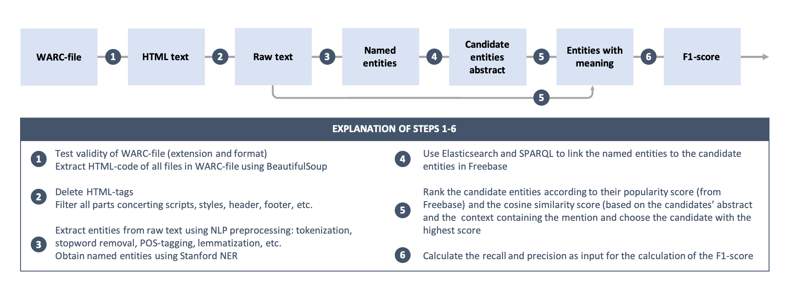

# Setup and running
## Python
This project is configured to run with **Python 3.6**. In order to load Python 3.6 on the DAS4 cluster, please run `module load python/3.6.0`

## Pipenv
Make sure you have pipenv installed. If you don't, you can install it using the following command: `pip install pipenv`.

## Spark
In order to run the scripts within Spark, you need to have Spark installed. You can find more information [here](https://spark.apache.org/docs/latest/).

Before running the script, please set the location of `spark-submit` to the **SPARK_SUBMIT_LOCATION** environment variable. Example:
`export SPARK_SUBMIT_LOCATION=/local/spark/spark-2.4.0-bin-hadoop2.7/bin/spark-submit`
## Running
You can easily run the code within spark by executing the script ***spark-run.sh***. First of all please make sure the 
 script has execution rights and if it doesn't, please execute: `chmod +x spark-run.sh` to allow the script to run.
 
 Before running the script, please make sure you are in the same directory with the script and then, you can execute it as follows:
 `./spark-run.sh [location of warc file]`.

## Entity Extraction
### NLP preprocessing

### Named Entity Recognition

## Entity Linking
After the entity mentions in the document are extracted, we link the mentions with their named entities to the Knowledge Base. We divide the entity linking into the following parts:

### Candidate Entity Generation - Query the Knowledge Base
If the mention is an English word, we link the input surface form of the mentions using ElasticSearch to Freebase. We'll obtain the 20 candidate named entities with the highest popularity score.

### Candidate Entity Ranking - Rank the candidate named entities
Next, we assign a score to each of the candidates, and rank them according to the score:
1. Check if the mention and the candidate is exactly the same. If so, set the score as Inf.
2. Calculate the cosine similarity of candidates' abstract and the context containing the mention.
3. We assign a new score for every candidate - the sum of the popularity score and the cosine similarity score.

### Link the mention and the candidates
Having the total score of each candidate entity, we select the candidate with the highest score to be the entity meaning.
